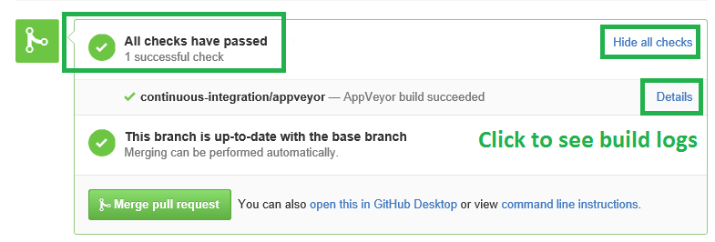
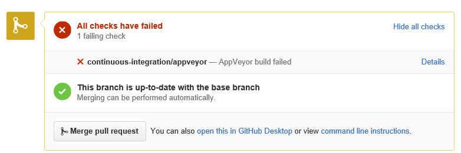

## Failing C# Calculator

This very simple calculator project isn't yet working, and we need to your help to fix it!

If you're not yet familiar with GitHub & AppVeyor, then read on! Otherwise, just go ahead and send your pull request :)

On GitHub, a pull request is a change proposal that is not yet part (or merged in Git's jargon) into the `master` branch of the repository. Pull requests can be reviewed both from a technical and functional point of view, either manually by developers and product owners, or automatically by continuous integration and code analysis tools.

At SonarSource, we use [AppVeyor](http://www.appveyor.com) to continuously build our C# GitHub repositories.
AppVeyor uses GitHub API to listen for new and updated pull requests, and:

1. Clones the repository at that pull request
* Compiles the code
* Runs the unit tests

If any of these steps fail, then the build fails. When AppVeyor is done, it sends its build status back to GitHub, to let developers know if more work is required on the pull request, or if it can be safely merged in the `master`. 

If the pull request succeeded to build, you'll see:

  

But if the build failed, this is what you'll see:

  

To get a better idea of what's wrong, you can click on the following badge for the logs of AppVeyor building the `master `branch: 

Now, the next steps are to:

1. Fork this repository
* Clone your fork on your machine
* Fix the code
* Commit and push your fix on your own fork on GitHub
* Send a pull request from your fork
* Watch AppVeyor build your pull request, and cross your fingers ;-)
* If the build failed, you can push further changes to your fork to update your pull request & trigger AppVeyor's build again

Good luck :)
